<h2>TensorFlow-FlexUNet-Image-Segmentation-Cervical-Cancer (2025/06/21)</h2>

This is the first experiment of Image Segmentation for Cervical-Cancer 
 based on our TensorFlowFlexUNet (TensorFlow Flexible UNet Image Segmentation Model for Multiclass) 
and, 512x512 pixels <a href="https://drive.google.com/file/d/1ZaF9fd4MdaJitJFLXi-F6JtYXy9B2HAT/view?usp=sharing">
Augmented-Cervical-Cancer-PNG-ImageMaskDataset.zip</a>, 
which was derived by us from 

<a href="https://www.kaggle.com/datasets/prahladmehandiratta/cervical-cancer-largest-dataset-sipakmed">
<b>Cervical Cancer largest dataset (SipakMed)</b>
</a>
  
On the derivation of a Cervical-Cancer-ImageMaskDataset, please see also our repository 
<a href="https://github.com/sarah-antillia/ImageMask-Dataset-Cervical-Cancer">ImageMask-Dataset-Cervical-Cancer</a>.
 
 

<b>Actual Image Segmentation for Images of 512x512 pixels</b> 
As shown below, the inferred masks predicted by our segmentation model trained on the PNG dataset appear similar to the ground truth masks, 
but lack precision in some areas. To improve segmentation accuracy, we could consider using a different 
segmentation model better suited for this task, or explore online data augmentation strategies.  
<table>
<tr>
<th>Input: image</th>
<th>Mask (ground_truth)</th>
<th>Prediction: inferred_mask</th>
</tr>
<tr>
<td>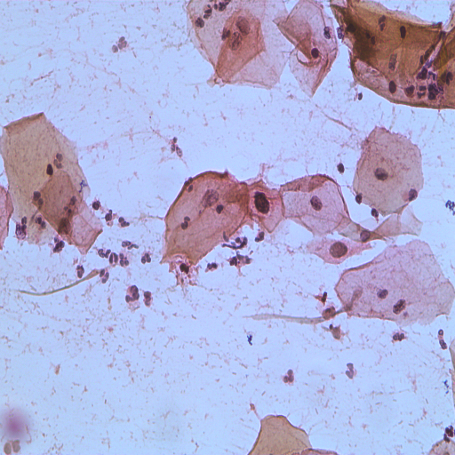</td>
<td>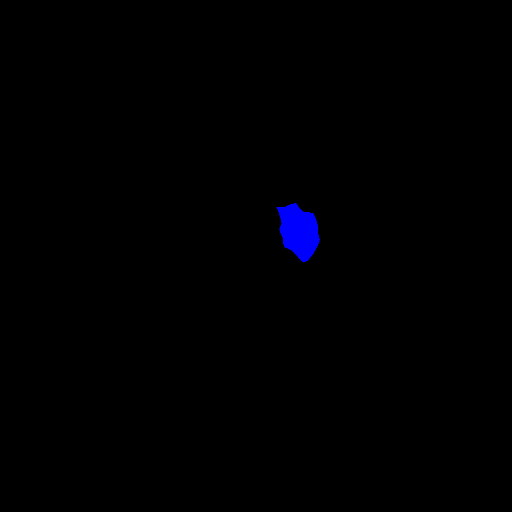</td>
<td></td>
</tr>

<tr>
<td>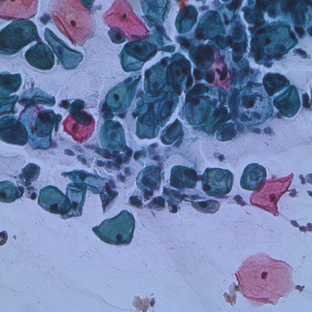</td>
<td>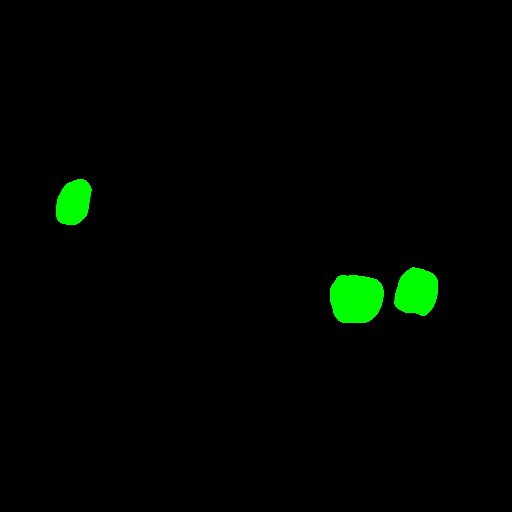</td>
<td>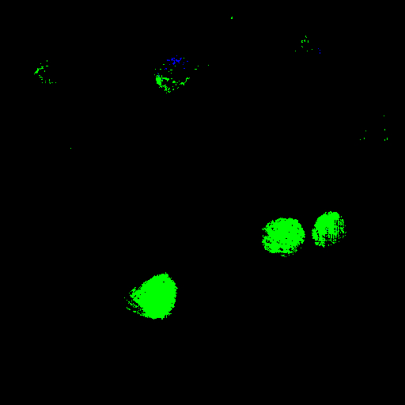</td>
</tr>

<tr>
<td>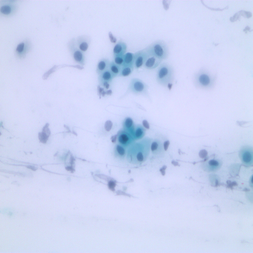</td>
<td>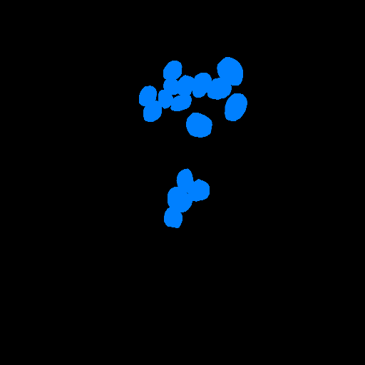</td>
<td>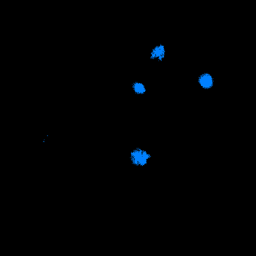</td>
</tr>
</table>

 

<h3>1. Dataset Citation</h3>

The original dataset used here has been taken from the following kaggle website: 
<a href="https://www.kaggle.com/datasets/prahladmehandiratta/cervical-cancer-largest-dataset-sipakmed">
<b>Cervical Cancer largest dataset (SipakMed)</b>
</a>

<h3>1. Dataset Citation</h3>

<b>About Dataset</b> 

<b>Context</b> 
Cervical cancer is the fourth most common cancer among women in the world, estimated more than 0.53 million  
women are diagnosed in every year but more than 0.28 million women’s lives are taken by cervical cancer  
in every years . Detection of the cervical cancer cell has played a very important role in clinical practice. 
 
<b>Content</b> 
The SIPaKMeD Database consists of 4049 images of isolated cells that have been manually cropped from 966 cluster 
 cell images of Pap smear slides. These images were acquired through a CCD camera adapted to an optical microscope.  
 The cell images are divided into five categories containing normal, abnormal and benign cells. 
 
<b>Acknowledgements</b> 
IEEE International Conference on Image Processing (ICIP) 2018, Athens, Greece, 7-10 October 2018. 

<b>Inspiration</b> 
CERVICAL Cancer is an increasing health problem and an important cause of mortality in women worldwide.  
Cervical cancer is a cancer is grow in the tissue of the cervix . It is due to the abnormal growth of cell that  
are spread to the other part of the body. 
Automatic detection technique are used for cervical abnormality to detect Precancerous cell or cancerous cell  
than no pathologist are required for manually detection process. 
 

<h3>
<a id="2">
2 Cervical-Cancer ImageMask Dataset
</a>
</h3>
 If you would like to train this Cervical-Cancer Segmentation model by yourself,
 please download the dataset from the google drive  
<a href="https://drive.google.com/file/d/1ZaF9fd4MdaJitJFLXi-F6JtYXy9B2HAT/view?usp=sharing">
Augmented-Cervical-Cancer-PNG-ImageMaskDataset.zip</a>
, expand the downloaded ImageMaskDataset and put it under <b>./dataset</b> folder to be
<pre>
                    (The Numbef of files)
./dataset
/Cervical-Cancer
├─test
│  ├─Koilocytotic
│  │  ├─images     ( 25)
│  │  └─masks      ( 25)
│  ├─Metaplastic
│  │  ├─images     ( 28)
│  │  └─masks      ( 28)
│  └─Parabasal
│      ├─images     ( 12)
│      └─masks      ( 12)
├─train
│  ├─Koilocytotic   
│  │  ├─images     (664)
│  │  └─masks      (664)
│  ├─Metaplastic
│  │  ├─images     (756)
│  │  └─masks      (756)
│  └─Parabasal
│      ├─images     (300)
│      └─masks      (300)
└─valid
    ├─Koilocytotic   
    │  ├─images     (188)
    │  └─masks      (188)
    ├─Metaplastic 
    │  ├─images     (216)
    │  └─masks      (216)
    └─Parabasal
        ├─images     ( 84)
        └─masks      ( 84)
</pre>
 
On the derivation of this 512x512 pixels PNG dataset, we used Python script 
<a href="./generator/ImageMaskDatasetGenerator.py">ImageMaskDatasetGenerator.py</a> 
 
For simplicity and demonstration purpose, in this experiment, we excluded the following two categories from the orignal dataset. 
<pre>
 ├─Dyskeratotic
 ├─Superficial-Intermediate
</pre>
 
 
<b>Koilocytotic Train_images_sample</b> 
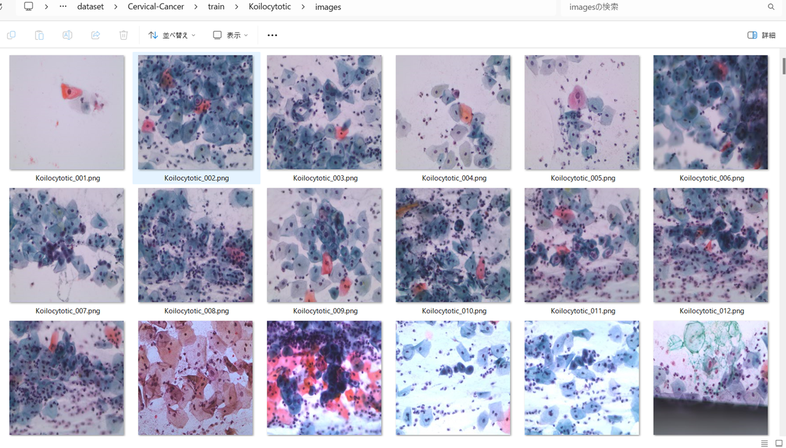
 
<b>Koilocytotic Train_masks_sample</b> 

 
 
<b>Metaplastic Train_images_sample</b> 
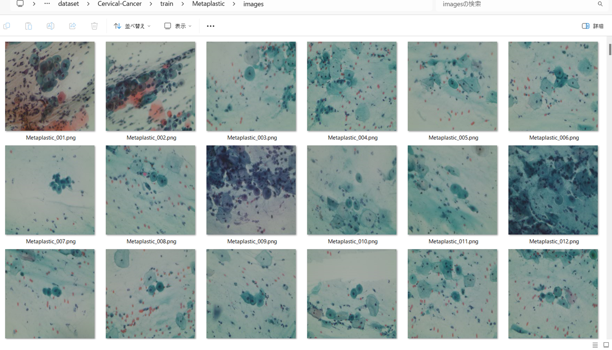
 
<b>Metaplastic Train_masks_sample</b> 
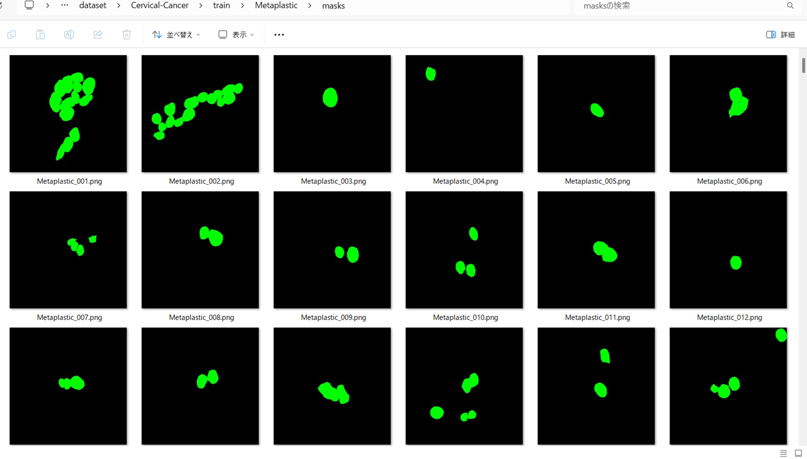
 
 
<b>Parabasal Train_images_sample</b> 
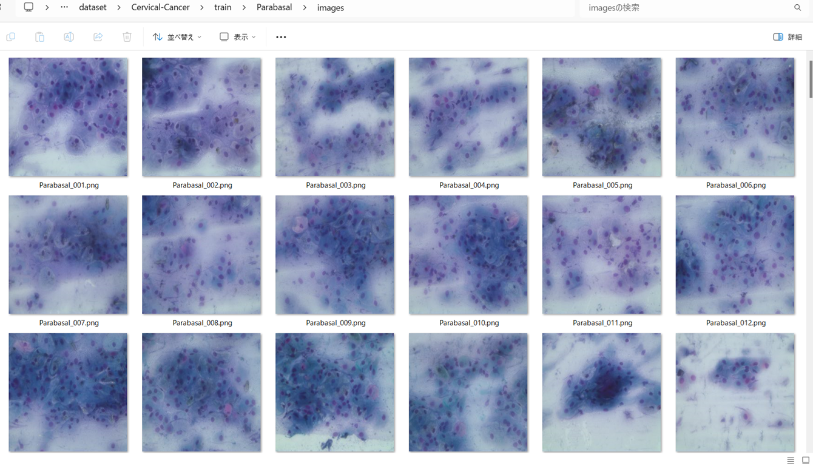
 
<b>Parabasal Train_masks_sample</b> 
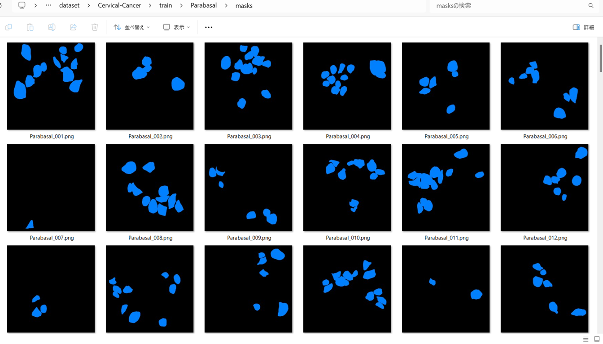
 
<h3>
3 Train TensorflowUNet Model
</h3>
 We have trained Cervical-CancerTensorflowUNet Model by using the following
<a href="./projects/TensorFlowFlexUNet/Cervical-Cancer/train_eval_infer.config"> <b>train_eval_infer.config</b></a> file.  
Please move to ./projects/TensorFlowFlexUNet/Cervical-Cancerand run the following bat file. 
<pre>
>1.train.bat
</pre>
, which simply runs the following command. 
<pre>
>python ../../../src/TensorflowFlexUNetTrainer.py ./train_eval_infer.config
</pre>

<b>Model parameters</b> 
Defined a small <b>base_filters</b> and large <b>base_kernels</b> for the first Conv Layer of Encoder Block of 
<a href="./src/TensorflowFlexUNet.py">TensorflowFlexUNet.py</a> 
and a large num_layers (including a bridge between Encoder and Decoder Blocks).
<pre>
[model]
base_filters   = 16
base_kernels   = (9,9)
num_layers     = 8
num_classes    = 4
dilation       = (3,3)
</pre>

<b>Learning rate</b> 
Defined a very small learning rate.  
<pre>
[model]
learning_rate  = 0.00007
</pre>

<b>Online augmentation</b> 
Disabled our online augmentation.You may train this model by setting this generator parameter to True. 
<pre>
[model]
model         = "TensorflowUNet"
generator     = False
</pre>

<b>Loss and metrics functions</b> 
Specified "categorical_crossentropy" and <a href="./src/dice_coef_multiclass.py">"dice_coef_multiclass"</a>. 
<pre>
[model]
loss           = "categorical_crossentropy"
metrics        = ["dice_coef_multiclass"]
</pre>
<b>Learning rate reducer callback</b> 
Enabled learing_rate_reducer callback, and a small reducer_patience.
<pre> 
[train]
learning_rate_reducer = True
reducer_factor     = 0.4
reducer_patience   = 4
</pre>
<b>Dataset path</b> 
Used wildcards in the data paths to include all images and masks for each category.
<pre>
[train]
mages_dir  = "../../../dataset/Cervical-Cancer/train/*/images/"
masks_dir  = "../../../dataset/Cervical-Cancer/train/*/masks/"
[valid]
images_dir = "../../../dataset/Cervical-Cancer/valid/*/images/"
masks_dir  = "../../../dataset/Cervical-Cancer/valid/*/masks/"
</pre>
<b>Early stopping callback</b> 
Enabled early stopping callback with patience parameter.
<pre>
[train]
patience      = 10
</pre>
<b>Mask RGB_map</b> 
[mask]
<pre>
mask_datatype    = "categorized"
mask_file_format = ".png"
; "Koilocytotic": (0, 0, 255)
; "Metaplastic":  (0, 255, 0)
; "Parabasal"  :  (0, 128, 255)
; Background:black, 
rgb_map = {(0,0,0):0, (0, 0, 255):1, (0,255,0):2, (0, 128, 255):3}
</pre>
<b>Epoch change inference callbacks</b> 
Enabled epoch_change_infer callback. 
<pre>
[train]
epoch_change_infer       = True
epoch_change_infer_dir   =  "./epoch_change_infer"
epoch_changeinfer        = False
epoch_changeinfer_dir    = "./epoch_changeinfer"
num_infer_images         = 6
</pre>

By using this callback, on every epoch_change, the inference procedure can be called
 for 6 images in <b>mini_test</b> folder. This will help you confirm how the predicted mask changes 
 at each epoch during your training process.  
As shown below, early in the model training, the predicted masks from our UNet segmentation model showed 
discouraging results.
 However, as training progressed through the epochs, the predictions gradually improved. 
   
 
<b>Epoch_change_inference output at starting (epoch 1,2,3)</b> 
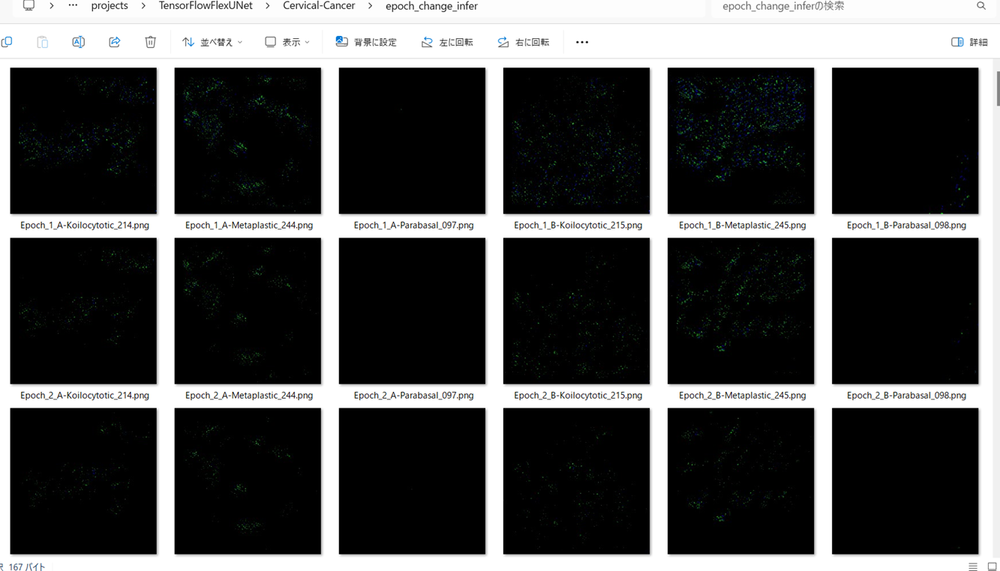 
 

<b>Epoch_change_inference output at middlepoint (epoch 18,19,20)</b> 
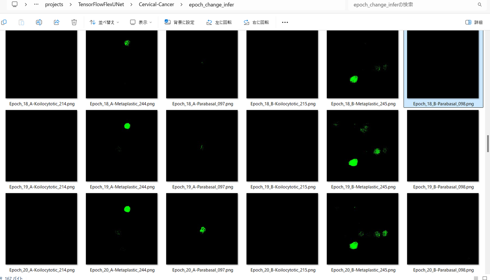 
 
<b>Epoch_change_inference output at ending (epoch 38,39,40)</b> 
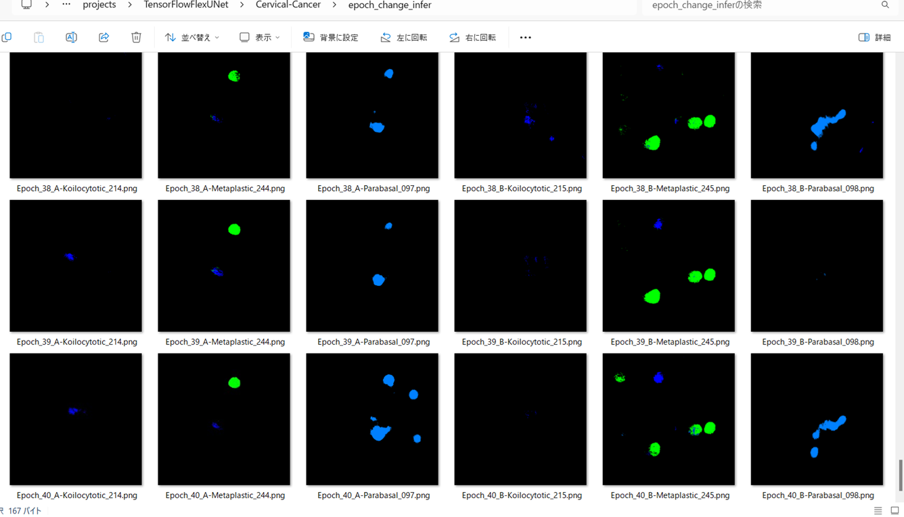 
 

In this experiment, the training process was stopped at epoch 40 by EarlyStopping callback.  
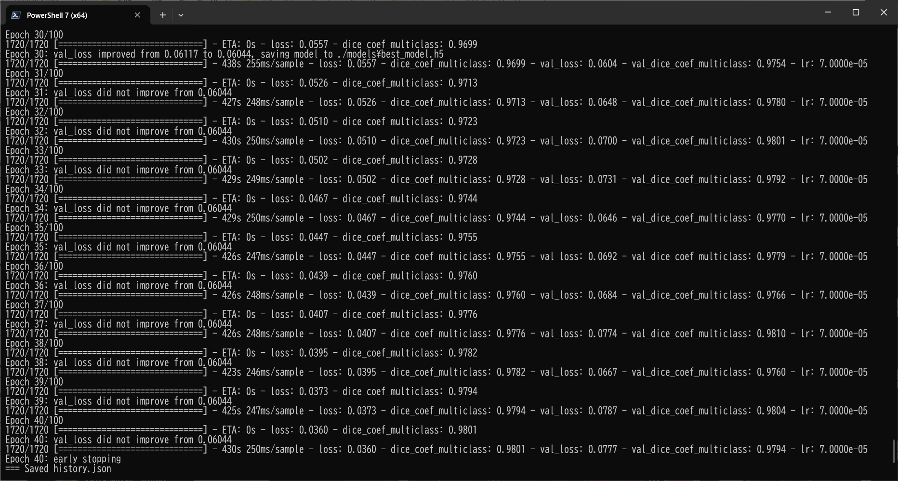 
 

<a href="./projects/TensorFlowFlexUNet/Cervical-Cancer/eval/train_metrics.csv">train_metrics.csv</a> 
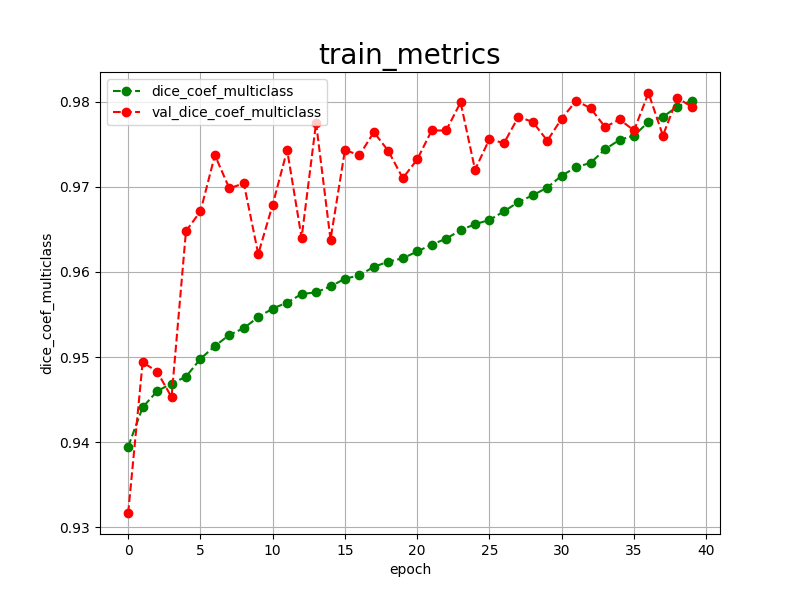 

 
<a href="./projects/TensorFlowFlexUNet/Cervical-Cancer/eval/train_losses.csv">train_losses.csv</a> 
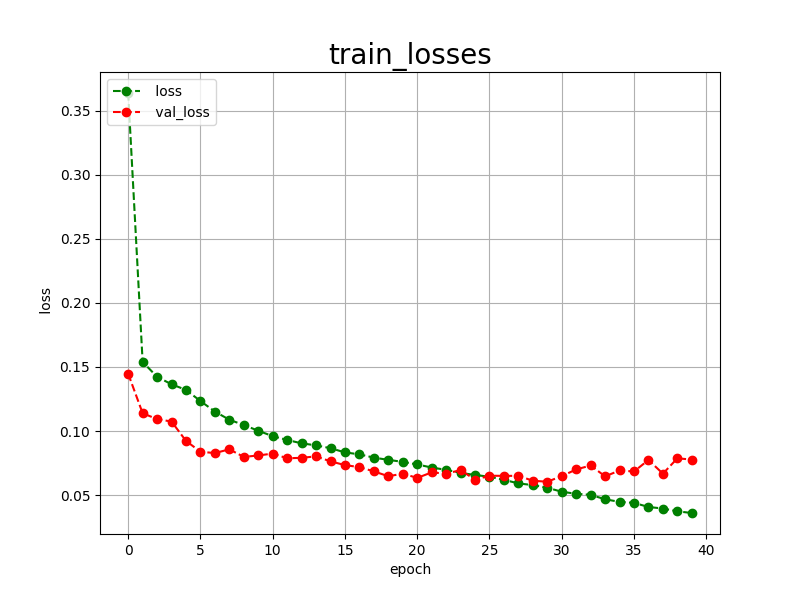 

 

<h3>
4 Evaluation
</h3>
Please move to a <b>./projects/TensorFlowFlexUNet/Cervical-Cancer</b> folder, 
and run the following bat file to evaluate TensorflowUNet model for Cervical-Cancer. 
<pre>
./2.evaluate.bat
</pre>
This bat file simply runs the following command.
<pre>
python ../../../src/TensorflowFlexUNetEvaluator.py ./train_eval_infer_aug.config
</pre>

Evaluation console output: 
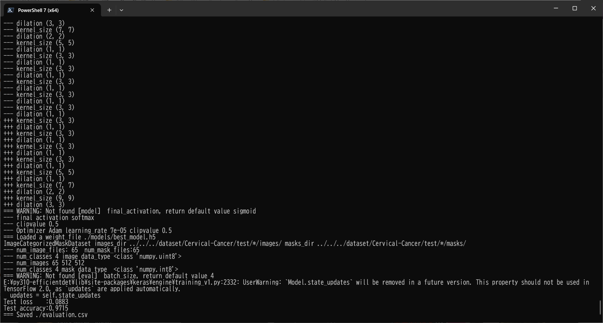
  Image-Segmentation-Cervical-Cancer

<a href="./projects/TensorFlowFlexUNet/Cervical-Cancer/evaluation.csv">evaluation.csv</a> 

The loss (bce_dice_loss) to this Cervical-Cancer/test was very low, and dice_coef very high as shown below.
 
<pre>
categorical_crossentropy,0.0883
dice_coef_multiclass,0.9715
</pre>
 

<h3>
5 Inference
</h3>
Please move to a <b>./projects/TensorFlowFlexUNet/Cervical-Cancer</b> folder 
,and run the following bat file to infer segmentation regions for images by the Trained-TensorflowUNet model for Cervical-Cancer. 
<pre>
./3.infer.bat
</pre>
This simply runs the following command.
<pre>
python ../../../src/TensorflowFlexUNetInferencer.py ./train_eval_infer_aug.config
</pre>

<b>mini_test_images</b> 
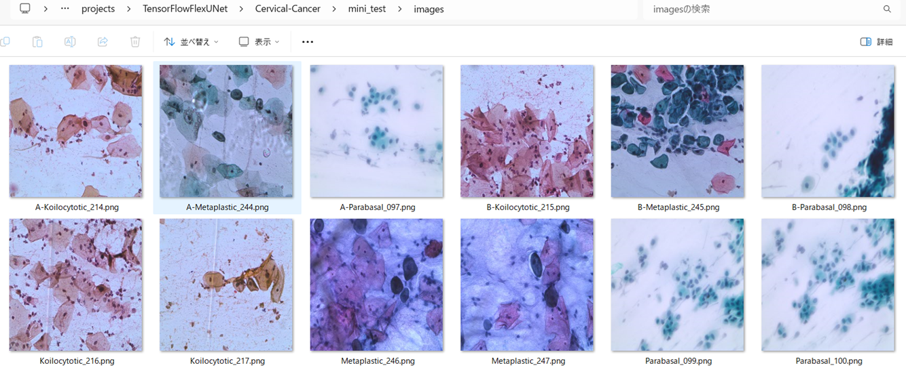 
<b>mini_test_mask(ground_truth)</b> 
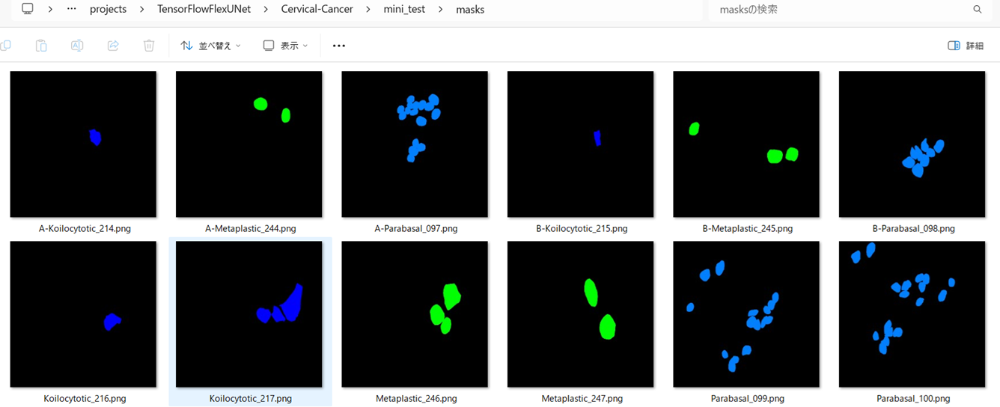 

<b>Inferred test masks</b> 
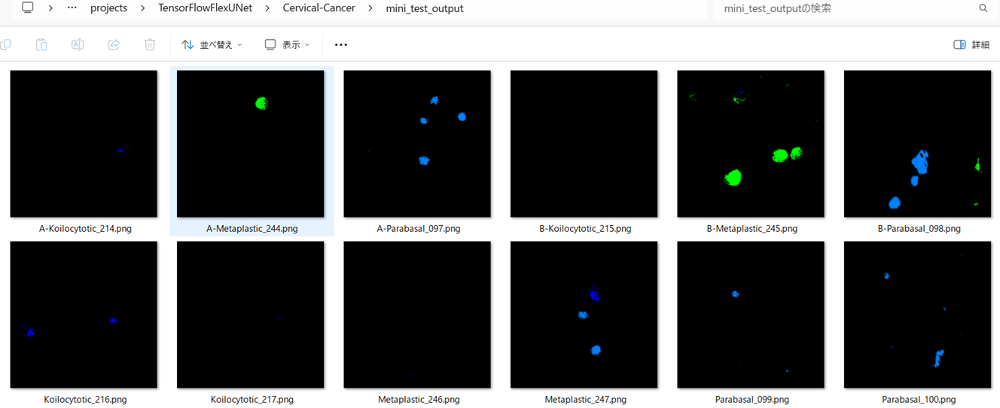 
 

<b>Enlarged images and masks </b> 

<table>
<tr>
<th>Image</th>b
<th>Mask (ground_truth)</th>
<th>Inferred-mask</th>
</tr>
<tr>
<td></td>
<td></td>
<td></td>
</tr>
<tr>
<td>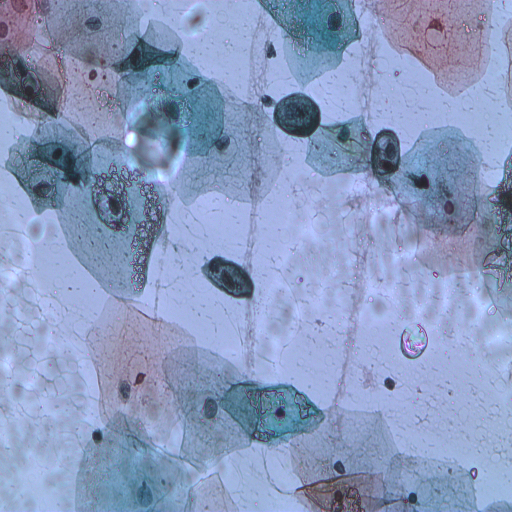</td>
<td>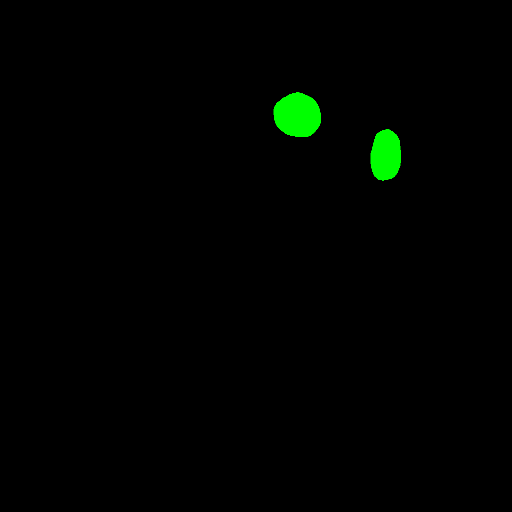</td>
<td>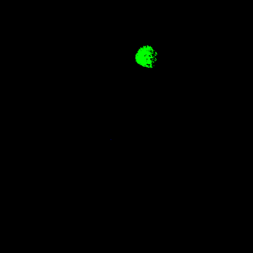</td>
</tr>
<tr>
<td></td>
<td></td>
<td></td>
</tr>
<tr>
<td>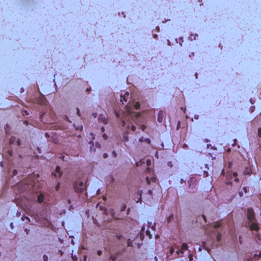</td>
<td>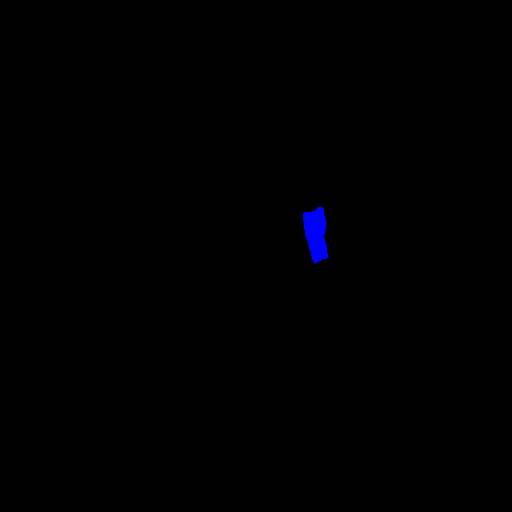</td>
<td></td>
</tr>

<tr>
<td></td>
<td></td>
<td></td>
</tr>

<tr>
<td>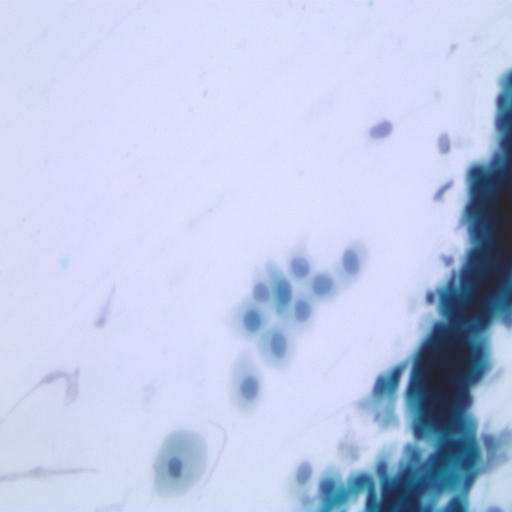</td>
<td>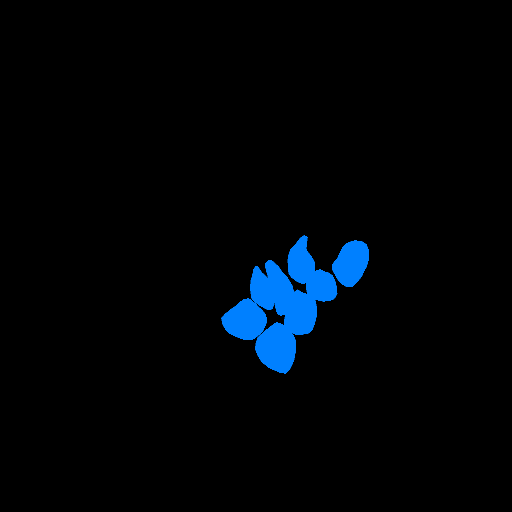</td>
<td>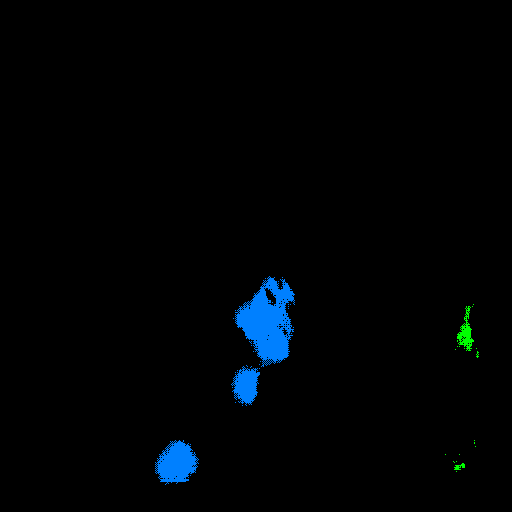</td>
</tr>

</table>

 

<h3>
References
</h3>

<b>1. Tensorflow-Tiled-Image-Segmentation-Augmented-Cervical-Cancer</b> 
Toshiyuki Arai @antilli.com 
<a href="https://github.com/sarah-antillia/Tensorflow-Tiled-Image-Segmentation-Augmented-Cervical-Cancer">
https://github.com/sarah-antillia/Tensorflow-Tiled-Image-Segmentation-Augmented-Cervical-Cancer</a>
 
 
<b>2. Tensorflow-Image-Segmentation-Cervical-Cancer</b> 
Toshiyuki Arai @antillia.com 
<a href="https://github.com/sarah-antillia/Tensorflow-Image-Segmentation-Cervical-Cancer">
https://github.com/sarah-antillia/Tensorflow-Image-Segmentation-Cervical-Cancer
</a>
 

